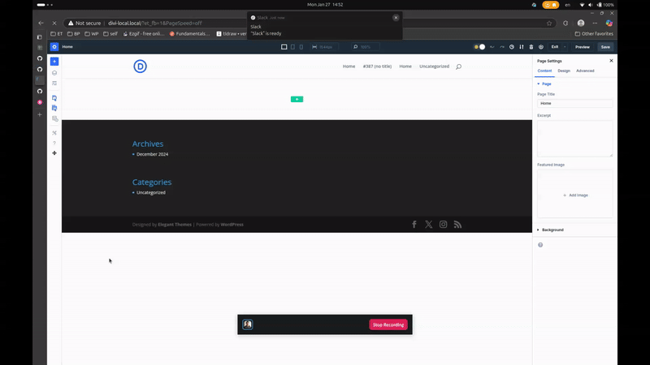

# D5 Modal Dev Clipboard

URL: https://github.com/elegantthemes/d5i-modal-dev-clipboard

## Description
Custom modal for D5 visual builder that displays current content of clipboard.

> Content of clipboard is filled by right click + copy module or copy style.

## Installation

### 1. Clone the repository

```bash
git clone {URL}
```

### 2. Install dependencies

```bash
npm install
```

### 3. Build the project

```bash
npm run build
```


## Preview

