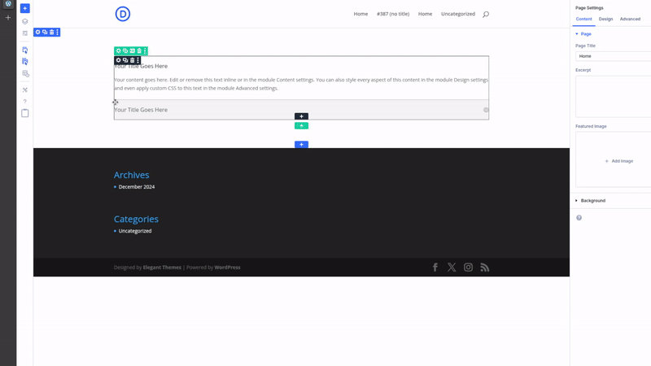

# D5 Modal Dev Clipboard

URL: https://github.com/elegantthemes/d5i-modal-dev-clipboard

## Description
Custom modal for D5 visual builder that displays current content of clipboard.

> Content of clipboard is filled by right click + copy module or copy style.

## Installation

### 1. Clone the repository

```bash
git clone https://github.com/elegantthemes/d5i-modal-dev-clipboard
```

### 2. Install dependencies

```bash
npm install
```

### 3. Build the project

```bash
npm run build
```

## Project Directory Structure

```
.github/ 
    CODEOWNERS
.gitignore
assets/
build/
    add-bar-builder-buttons.js
    bundle.js
d5-extension-example-modal-dev-clipboard.php
package.json
README.md
src/
    add-bar-builder-buttons.js
    index.jsx
    modal/
        component.jsx
        container.jsx
        registerDevClipboard.js
    Object-rerender/
webpack.config.js
```
Few notes about the project directory structure:

- We have two build files as we need to enqueue  `add-bar-builder-buttons.js` with 'in_footer' set to true and `bundle.js` with 'in_footer' set to false or not added at all.

- If you want to add new buttons to the add bar, you can do so by adding them to `add-bar-builder-buttons.js`.
- And if you want to add new modals, you can do so by adding them to the `src/modal` directory, taking into account that this was meant for one modal only. You need to add a wrapper directory to contain all modals, then register them in the `src/modal/registerDevClipboard.js` file.


## Preview

